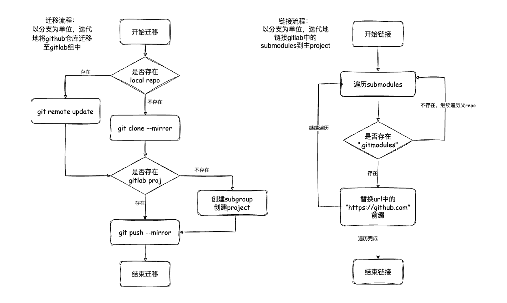

# github-migrate-tool

用于将 GitHub Repo 及其 submodules 整体迁移到 GitLab Project 的工具  

## Requirement

1. 安装 curl 和 jq

    ```bash
    sudo apt-get install curl jq -y
    ```

2. 安装 git-lfs，参考：[[installing-git-large-file-storage]](https://docs.github.com/en/repositories/working-with-files/managing-large-files/installing-git-large-file-storage)

    ```bash
    # 配置lfs.locksverify
    git config --global lfs.locksverify true
    ```

## Running

### Static

静态脚本会将主仓库及子模块的所有分支迁移到目标群组中，会在中转机上下载大量空仓库

1. 创建 GitHub Token 及 GitLab Token 用于访问服务，参考:
    [[GitHub-repo权限]](https://docs.github.com/en/authentication/keeping-your-account-and-data-secure/managing-your-personal-access-tokens#creating-a-personal-access-token-classic)
    [[GitLab-api权限]](https://docs.gitlab.com/ee/user/profile/personal_access_tokens.html#create-a-personal-access-token)

    ```bash
    export GITHUB_TOKEN="<GITHUB_TOKEN>"
    export GITLAB_TOKEN="<GITLAB_TOKEN>"
    ```

2. 创建 GitLab Group 作为目标迁移路径，参考: [[create-a-group]](https://docs.gitlab.com/ee/user/group/#create-a-group)

3. 迁移 GitHub Repo -> GitLab Project

    ```bash
    # 参数 [-s:待迁移仓库] [-t:目标Group] [-b:指定分支(可选，无指定则迁移所有分支)]
    ./migrate-static.sh -s <src_repo> -t <tar_group> -b <branch>
    ```

4. 从 GitLab 克隆项目

    ```bash
    git clone --recursive -b <branch> <proj_url>
    ```

脚本执行结果如下:
1. 本地保存源仓库的镜像仓库，路径如：`./user/repo`
2. 在目标 Group 中创建 subgroup，命名为：`user`
3. 在 subgroup 中创建 proj，命名为：`repo`

此外，还在本地 `./.migrate_log` 目录下存储执行必要的跟踪文件

### Dynamic

动态脚本会根据当前本地仓库的状态，动态替换已迁移依赖的url以及更新新依赖到GitLab依赖群组中

1. 创建 GitLab Token 和依赖群组( GitLab Group，命名为 `<deps_group_name>` )，操作同上

2. 克隆 GitHub 项目到本地

    ```bash
    git clone https://github.com/xxx/xxx -b master <local_path>
    ```

3. 执行迁移脚本

    ```bash
    export GITLAB_TOKEN=<gitlab_token>
    export GITLAB_HOST=http://oauth2:<gitlab_token>@<gitlab_host>
    export DEPS_GROUP=<deps_group_name>
    ./migrate-dynamic.sh <local_path>
    ```

脚本会检测本地仓库的每个子模块，
1. 若存在于依赖组则替换 url 直接 clone
2. 若不存在于依赖组则从 GitHub 下载并 push 到依赖组中
3. 执行完脚本，本地仓库直接可用，相当于执行 `git submoudle update --init --recursive`

## Description

### Static

<p align="center">
    
</p>

原理：  
将主仓库与子模块之间的依赖关系看作一棵树，对于只存在直接子模块的仓库直接修改 `.gitmodules` 中的 url 即可，

```bash
git submodule set-url <submodule_path> <new_url>
```

但若是存在间接的子模块（即，两层以上的依赖树），则需要修改中间结点的 `.gitmodules` 并提交到指定的 commit 以后。首先，git 以 commit sha 来追踪子模块，输出 submodule 的状态可以看到类似信息，

```bash
git submodule status
# -6ad3ad49e37784dc24000f52b49023c71c5e1b99 path
```

其次，指定 commit 后仍会有其他提交，无法保证仍可以顺利通过编译，故静态脚本基于每个中间结点的 commit 创建新的临时链接分支，名为 "_<commit_sha>"。并将新旧 commit 的映射关系存储在 `.migrate_log` 路径下。

### Dynamic

动态脚本直接遍历本地仓库的每个子模块。若存在已经迁移的仓库，且在已迁移仓库中能匹配到对应的 commit sha，则直接修改 url，并更新子模块。若未满足以上条件，则使用原始 url 更新子模块，并 push 到 GitLab 上，操作如下

```bash
git submodule update --init <submodule_path>
cd <submodule_path>
git push gitlab HEAD:ref/heads/_<commit_sha>
```
